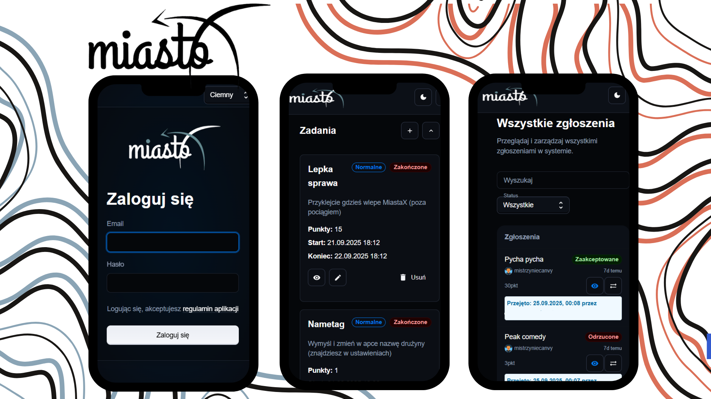

# MiastoX

MiastoX to aplikacja stworzona na wydarzenie organizowane przez Samorząd Studencki – wyścig autostopowy po Polsce, w którym uczestnicy w parach ścigali się do tajemniczego „miasta X”.
Podczas wyścigu drużyny wykonywały różne zadania rozrzucone po całym kraju, a aplikacja ułatwiała zarówno uczestnikom, jak i organizatorom sprawną komunikację i obsługę wydarzenia.

## O projekcie

- Uczestnicy mogli w prosty sposób zgłaszać wykonane zadania.

- Administratorzy mieli panel do szybkiej oceny zgłoszeń, zarządzania zadaniami i uczestnikami.

- Aplikacja powstała w ciągu miesiąca, więc sporo rzeczy wymaga jeszcze dopracowania i rozwoju na przyszłe edycje.

## Funkcje

- logowanie i rejestracja drużyn,

- przesyłanie zgłoszeń (np. zdjęcia z wykonanych zadań),

- panel admina do weryfikacji i przyznawania punktów,

- zarządzanie zadaniami i listą uczestników.

## Screenshoty
  
